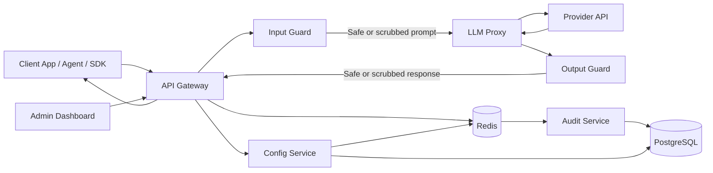
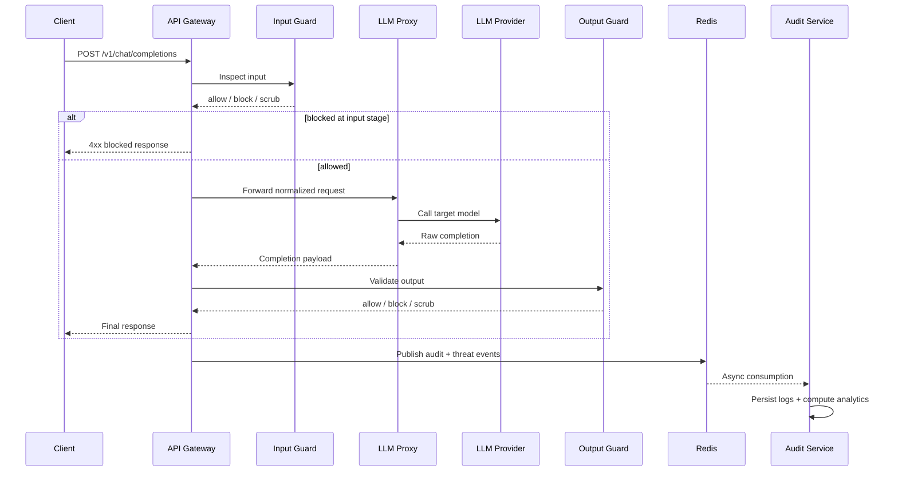

# GuardLayer

<p align="center">
  <strong>Open-source LLM security gateway with guardrails, auditing, analytics, and an admin dashboard.</strong>
</p>

<p align="center">
  
  
  
  
</p>

GuardLayer sits in front of your LLM traffic and applies configurable safety checks before and after every model call. It provides an OpenAI-compatible gateway for applications, a web dashboard for operators, per-key policy management, CSV exports, real-time threat monitoring, and an audit trail for every request.

It is designed for teams that want a self-hosted control plane for LLM usage without rewriting their existing AI app integrations.

## Why GuardLayer

- OpenAI-compatible `/v1/chat/completions` gateway for low-friction adoption
- Input guardrails for prompt injection, jailbreaks, PII scrubbing, topic filtering, and token limits
- Output guardrails for toxicity and hallucination checks
- Per-API-key policies with fallback to a global default configuration
- Real-time threat streaming and audit/event analytics
- Self-hosted microservice architecture using Docker, PostgreSQL, Redis, TypeScript, Python, and React
- Admin dashboard for keys, logs, analytics, and configuration tuning

## Screenshots

<p align="center">
  
</p>

<p align="center">
  
</p>

## Architecture



### Core services

| Service | Port | Stack | Responsibility |
| --- | ---: | --- | --- |
| `api-gateway` | `8080` | TypeScript + Express | Main entrypoint for `/v1/*` and `/api/*` |
| `config-service` | `3001` | TypeScript + Express | API keys, policy config, auth-backed admin config APIs |
| `input-guard` | `8001` | Python + FastAPI | Pre-LLM prompt inspection and scrubbing |
| `output-guard` | `8002` | Python + FastAPI | Post-LLM response validation and scrubbing |
| `llm-proxy` | `8003` | TypeScript + Express | Provider abstraction and fallback routing |
| `audit-service` | `8004` | TypeScript + Express | Audit logs, threat logs, analytics, SSE |
| `dashboard` | Vite dev server | React + TypeScript | Operator UI for auth, keys, logs, analytics, settings |
| `postgres` | `5432` | PostgreSQL 15 | Persistent relational storage |
| `redis` | `6379` | Redis 7 | Rate limiting, pub/sub, queueing, real-time events |

## Request lifecycle



## Repository layout

```text
.
|-- config/
|-- dashboard/
|-- docker/
|-- docs/
|-- img/
|-- services/
|   |-- api-gateway/
|   |-- audit-service/
|   |-- config-service/
|   |-- db-migrations/
|   |-- input-guard/
|   |-- llm-proxy/
|   `-- output-guard/
|-- tests/
|   `-- integration/
|-- docker-compose.yml
`-- docker-compose.test.yml
```

## Features

### Input guardrails

- Prompt injection detection
- Jailbreak detection
- PII scrubbing
- Topic allow-list filtering
- Token limit enforcement

### Output guardrails

- Toxicity scanning
- Hallucination detection
- Output PII scrubbing

### Platform features

- OpenAI-style chat completions endpoint
- Admin authentication with JWT
- API key lifecycle management
- Global default policy plus per-key overrides
- CSV exports for audit and threat logs
- Real-time threat events over SSE
- Analytics for traffic, latency, and block rates

## Tech stack

- Backend orchestration: TypeScript, Express
- Guard services: Python, FastAPI
- Frontend: React, Vite, Zustand, Recharts, Tailwind CSS
- Data stores: PostgreSQL, Redis
- Containers: Docker Compose
- Testing: Jest, Supertest, Playwright, Pytest-style Python test suite

## Quick start

### 1. Configure environment variables

Edit `.env` in the project root with values for your local environment:

```env
POSTGRES_USER=guardlayer_admin
POSTGRES_PASSWORD=guardlayer_dev_password_change_me
POSTGRES_DB=guardlayer
POSTGRES_PORT=5432
REDIS_PORT=6379
JWT_SECRET=change-this-to-a-long-random-secret
```

### 2. Start the backend stack

```bash
docker compose up --build
```

This starts PostgreSQL, Redis, database migrations, the gateway, config service, audit service, proxy service, and both guard services.

### 3. Verify health endpoints

```bash
curl http://localhost:8080/health
curl http://localhost:3001/health
curl http://localhost:8001/health
curl http://localhost:8002/health
curl http://localhost:8003/health
curl http://localhost:8004/health
```

### 4. Start the dashboard

The dashboard is developed separately from the Docker Compose backend stack:

```bash
cd dashboard
npm install
npm run dev
```

Set `VITE_API_BASE_URL` if your API gateway is not available at `http://localhost:8080`.

### 5. Create the first admin user

```bash
curl -X POST http://localhost:8080/api/auth/register \
  -H "Content-Type: application/json" \
  -d "{\"email\":\"admin@guardlayer.dev\",\"password\":\"securepassword123\"}"
```

Only the first registration is allowed. After that, use login.

### 6. Log in and create an API key

```bash
curl -X POST http://localhost:8080/api/auth/login \
  -H "Content-Type: application/json" \
  -d "{\"email\":\"admin@guardlayer.dev\",\"password\":\"securepassword123\"}"
```

Use the returned JWT to create a GuardLayer client API key:

```bash
curl -X POST http://localhost:8080/api/keys \
  -H "Authorization: Bearer <admin-jwt>" \
  -H "Content-Type: application/json" \
  -d "{\"name\":\"production-app\"}"
```

### 7. Configure upstream provider credentials

The current gateway implementation resolves provider credentials from environment variables on `api-gateway`, such as:

```env
OPENAI_API_KEY=your-openai-api-key
GEMINI_API_KEY=your-gemini-api-key
GROQ_API_KEY=your-groq-api-key
OPENROUTER_API_KEY=your-openrouter-api-key
```

If you are running with Docker Compose, add the provider keys you need under the `api-gateway` service environment in [`docker-compose.yml`](docker-compose.yml).

### 8. Send traffic through GuardLayer

```bash
curl -X POST http://localhost:8080/v1/chat/completions \
  -H "Authorization: Bearer <guardlayer-api-key>" \
  -H "Content-Type: application/json" \
  -d "{
    \"model\": \"openai/gpt-3.5-turbo\",
    \"messages\": [
      {\"role\": \"user\", \"content\": \"Summarize this ticket for the support team.\"}
    ],
    \"temperature\": 0.2
  }"
```

## Configuration model

GuardLayer uses a hierarchical policy model:

1. Global default configuration stored under `default`
2. Per-API-key overrides for stricter or more permissive behavior
3. Runtime enforcement in the gateway and guard services

Example policy fields:

```yaml
prompt_injection_enabled: true
prompt_injection_threshold: 0.75
jailbreak_enabled: true
jailbreak_threshold: 0.80
pii_scrubbing_enabled: true
pii_types:
  - email
  - phone
  - aadhaar
  - credit_card
topic_filter_enabled: true
allowed_topics:
  - support
  - billing
max_tokens: 1500
toxicity_enabled: true
toxicity_threshold: 0.85
hallucination_enabled: true
block_on_hallucination: false
```

See [docs/configuration.md](docs/configuration.md) for the full schema.

## API overview

### Admin APIs

- `POST /api/auth/register`
- `POST /api/auth/login`
- `GET /api/keys`
- `POST /api/keys`
- `GET /api/config/default`
- `PUT /api/config/default`
- `GET /api/audit`
- `GET /api/audit/export`
- `GET /api/threats`
- `GET /api/threats/export`
- `GET /api/analytics`

### Gateway APIs

- `POST /v1/chat/completions`

### Streaming

- `GET /api/stream/threats?token=<admin-jwt>`
- `GET /api/threats/stream`

See [docs/api-reference.md](docs/api-reference.md) for request and response examples.

## Integrating with existing apps

GuardLayer is intentionally OpenAI-compatible. In many clients, integration is just:

1. Change the base URL to `http://localhost:8080/v1`
2. Replace your provider API key with a GuardLayer API key

### Python

```python
from openai import OpenAI

client = OpenAI(
    base_url="http://localhost:8080/v1",
    api_key="your-guardlayer-api-key",
)

response = client.chat.completions.create(
    model="gpt-3.5-turbo",
    messages=[{"role": "user", "content": "Hello!"}],
)

print(response.choices[0].message.content)
```

### JavaScript

```javascript
import OpenAI from 'openai';

const client = new OpenAI({
  baseURL: 'http://localhost:8080/v1',
  apiKey: 'your-guardlayer-api-key',
});

const response = await client.chat.completions.create({
  model: 'gpt-3.5-turbo',
  messages: [{ role: 'user', content: 'Hello!' }],
});

console.log(response.choices[0].message.content);
```

More examples are available in [docs/integrations.md](docs/integrations.md).

Note: provider selection in the current gateway implementation is inferred from the requested model string. For example, `openai/gpt-3.5-turbo` routes to OpenAI and `gemini/gemini-1.5-flash` routes to Gemini.

## Local development

### Backend services

Each TypeScript service supports:

```bash
npm install
npm run dev
npm run test
```

Each Python guard service includes a `requirements.txt` and service-local tests.

### Dashboard

```bash
cd dashboard
npm install
npm run dev
npm run build
```

## Testing

GuardLayer includes unit, service, frontend, and integration coverage.

### Service tests

- TypeScript services: `npm test` inside each service directory
- Python guard services: run the test suite inside `services/input-guard` and `services/output-guard`

### Frontend tests

```bash
cd dashboard
npm install
npx playwright test
```

### Integration tests

```bash
docker compose -f docker-compose.test.yml up --build --abort-on-container-exit
```

Or run the integration package directly:

```bash
cd tests/integration
npm install
npm test
```

## Deployment notes

- Use persistent volumes for PostgreSQL and Redis
- Place a reverse proxy such as Nginx in front of the gateway for TLS termination
- Scale stateless services horizontally: `api-gateway`, `input-guard`, `output-guard`
- Use Redis for pub/sub and queue decoupling
- Back up PostgreSQL regularly

See [docs/self-hosting.md](docs/self-hosting.md) for production guidance.

## Documentation

- [Architecture](docs/architecture.md)
- [Configuration](docs/configuration.md)
- [Guards reference](docs/guards.md)
- [API reference](docs/api-reference.md)
- [Integrations](docs/integrations.md)
- [Self-hosting](docs/self-hosting.md)
- [Contributing](CONTRIBUTING.md)
- [Changelog](CHANGELOG.md)

## Roadmap ideas

- More provider adapters and routing policies
- Additional guard plugins and custom rule hooks
- Stronger policy versioning and rollout controls
- Multi-tenant administration and RBAC
- Richer observability and SIEM/export integrations

## Contributing

Contributions are welcome. If you want to improve a guard, add a provider integration, refine the dashboard UX, or strengthen the audit pipeline, start with [CONTRIBUTING.md](CONTRIBUTING.md).

Please open issues and pull requests with:

- a clear problem statement
- reproduction steps where relevant
- tests for behavior changes
- documentation updates for new config or API surface

## License

This project is licensed under the [MIT License](LICENSE).
